# CI/CD Pipeline – Flask Application

## 1. Project Information

**Project:** CI/CD Pipeline for Python Flask Application

**Submitted By:** Vinjith NV

**Program:** Postgraduate Program in Multi Cloud Architecture & DevOps – Batch 17A

**Technology Used:** GitHub Actions

**Application:** Python Flask

**Containerization:** Docker

**Container Registry:** Amazon ECR

**Deployment Target:** Amazon EC2

---

# 2. GitHub Repository

The complete source code, Dockerfile, test suite, GitHub Actions workflow, and documentation are available in the GitHub repository.

**Repository:**

https://github.com/vinjithkannan/flask_ci_cd_assignment

### Repository Structure

```text
flask_ci_cd_assignment/
│
├── app.py
├── requirements.txt
├── Dockerfile
├── test_app.py
├── README.md
│
└── .github/
    └── workflows/
        └── deploy.yml
```

### Screenshot – GitHub Repository

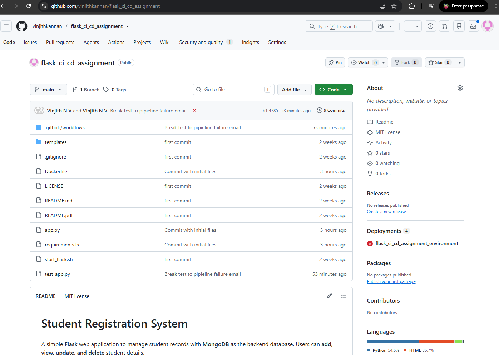

---

# 3. GitHub Actions Workflow

The CI/CD pipeline is implemented using GitHub Actions.

The workflow is located at:

```text
.github/workflows/deploy.yml
```

The pipeline is automatically triggered whenever code is pushed to the `main` branch.

### Pipeline Stages

```text
Checkout
   ↓
Install Dependencies
   ↓
Run Pytest
   ↓
Build Docker Image
   ↓
Push Image to Amazon ECR
   ↓
Deploy to EC2
   ↓
Health Check
   ↓
Email Notification
```

### Main Pipeline Requirements Implemented

* Automatic trigger on push to `main`
* Python dependency installation
* Automated Pytest execution
* Pipeline stops when tests fail
* Docker image creation
* Docker image tagged with Git commit SHA
* Image pushed to Amazon ECR
* Deployment to EC2 using SSH
* Existing container stopped and removed
* New container started
* `/health` endpoint verified
* Success/failure email notification

### Screenshot – GitHub Actions Workflow
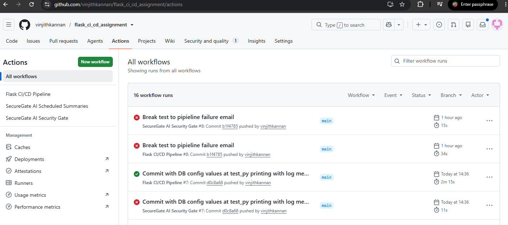
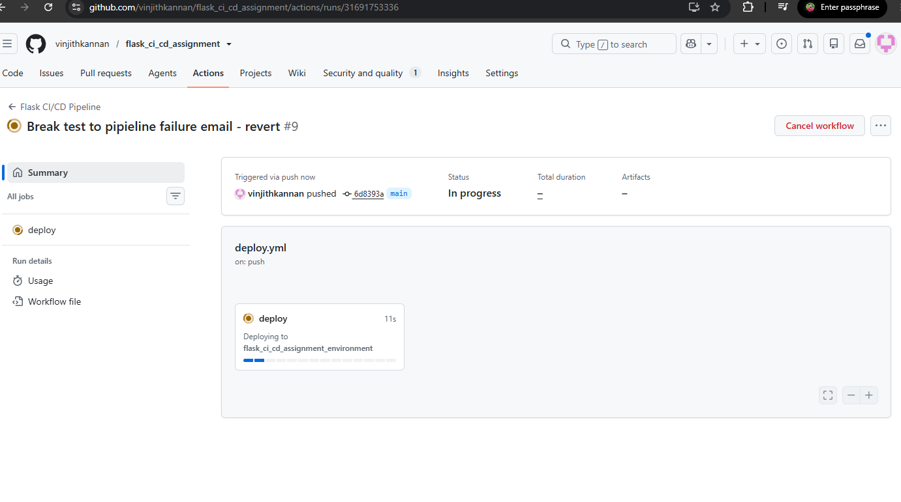

---

# 4. Successful / Green Pipeline

A successful pipeline execution was completed successfully.

The pipeline passed through all required stages:

| Stage                | Status   |
| -------------------- | -------- |
| Checkout             | ✅ Passed |
| Install Dependencies | ✅ Passed |
| Pytest               | ✅ Passed |
| Docker Build         | ✅ Passed |
| Push to ECR          | ✅ Passed |
| Deploy to EC2        | ✅ Passed |
| Health Check         | ✅ Passed |
| Success Email        | ✅ Sent   |

### Screenshot – Green Pipeline

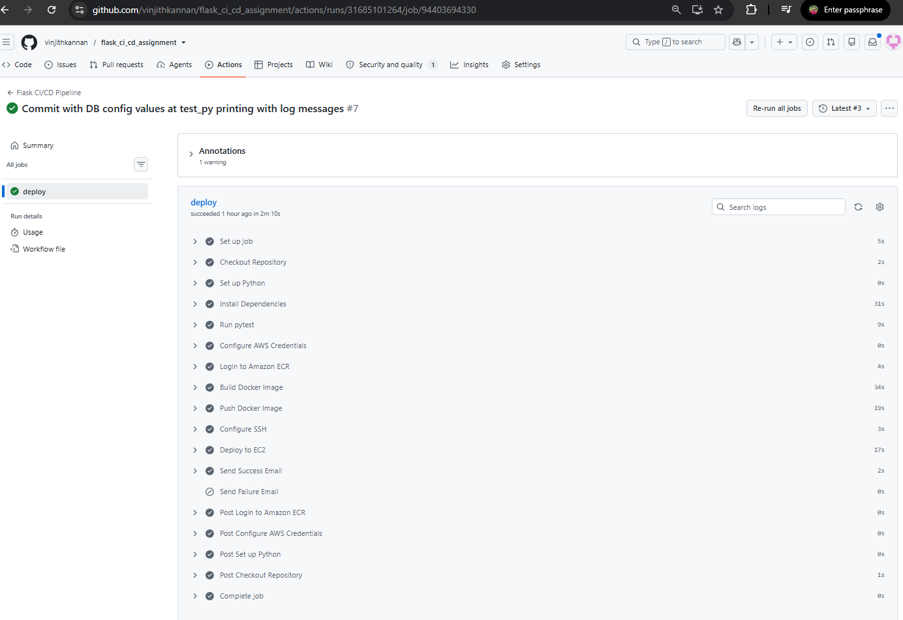

---

# 5. Docker Image in Amazon ECR

After successful testing, GitHub Actions builds the Docker image and pushes it to Amazon ECR.

The image is tagged using the Git commit SHA rather than using only the `latest` tag.

Example:

```text
<ECR_REGISTRY>/<ECR_REPOSITORY>:<COMMIT_SHA>
```

This provides traceability between the source-code commit and the deployed Docker image.

### ECR Repository

```text
Repository:
<ECR_REPOSITORY>

Region:
<AWS_REGION>
```

### Screenshot – ECR Image

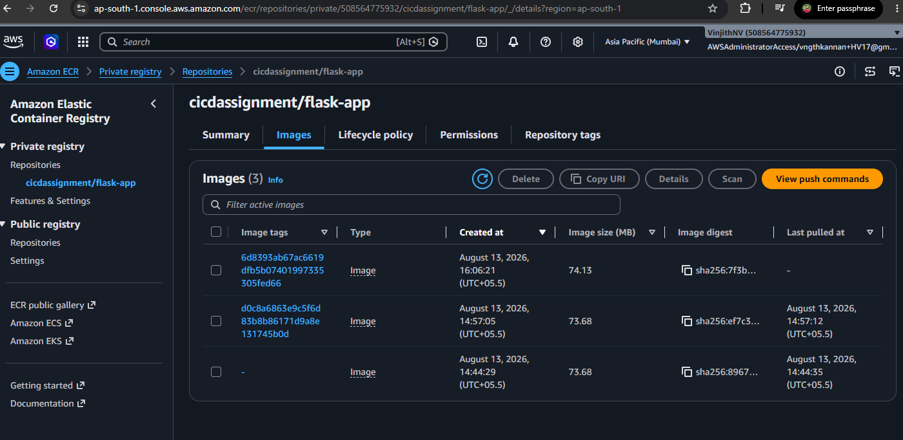

---

# 6. EC2 Deployment

The Docker image stored in Amazon ECR is deployed to the EC2 instance.

The deployment process performs the following operations:

```text
GitHub Actions
      ↓
SSH to EC2
      ↓
Login to ECR
      ↓
docker pull
      ↓
Stop existing container
      ↓
Remove existing container
      ↓
docker run
      ↓
Health Check
```

The EC2 instance has Docker installed and uses an IAM role with permission to pull images from Amazon ECR.

---

# 7. EC2 Running Container

After deployment, the Flask application is running inside a Docker container on EC2.

Container configuration:

```text
Container Name : flask-app
Application     : Flask
Container Port  : 5000
EC2 Port        : 80
```

Port mapping:

```text
EC2:80 → Docker:5000
```

### Screenshot – EC2 Running Container

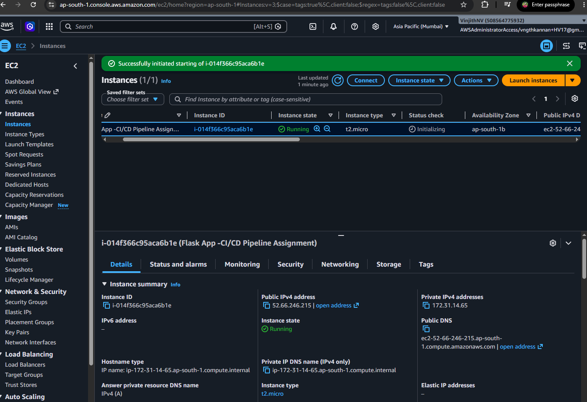

---

# 8. Docker PS Verification

The running container was verified directly on the EC2 instance using:

```bash
docker ps
```

Expected output contains the Flask application container.

Example:

```text
CONTAINER ID   IMAGE                         PORTS
xxxxxxxxxxxx   flask_ci_cd_assignment-app:<COMMIT_SHA>   0.0.0.0:80->5000/tcp
```

This confirms that the Docker container is running successfully on the EC2 instance.

### Screenshot – docker ps

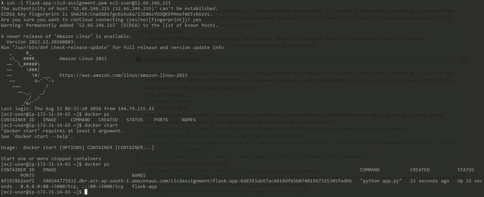

---

# 9. Browser – Flask Application

The deployed application was tested through a web browser using the EC2 public IP.

```text
http://<EC2_PUBLIC_IP>
```

The Flask application successfully returned the application response.

### Screenshot – Flask Application

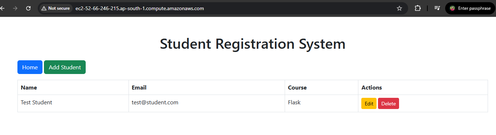

---

# 10. Browser – Health Endpoint

The deployment verification was performed using the application's health endpoint.

URL:

```text
http://<EC2_PUBLIC_IP/DNS>/health
```

Expected response:

```json
{
  "status": "healthy"
}
```

The successful response confirms that:

1. The EC2 instance is reachable.
2. Docker is running.
3. The Flask container is running.
4. The Flask application started successfully.
5. The application is accessible through the exposed port.

### Screenshot – Health Endpoint

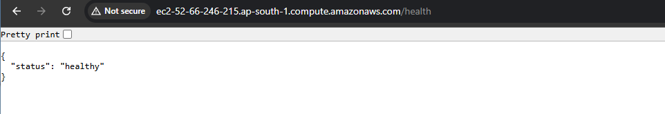

---

# 11. Success Email

After a successful deployment, GitHub Actions sends a customized success email.

The email contains:

* Success indicator
* Git commit SHA
* Branch
* Docker image tag
* EC2 target
* GitHub Actions workflow URL

Example subject:

```text
SUCCESS - Flask Deployment
```

### Screenshot – Success Email

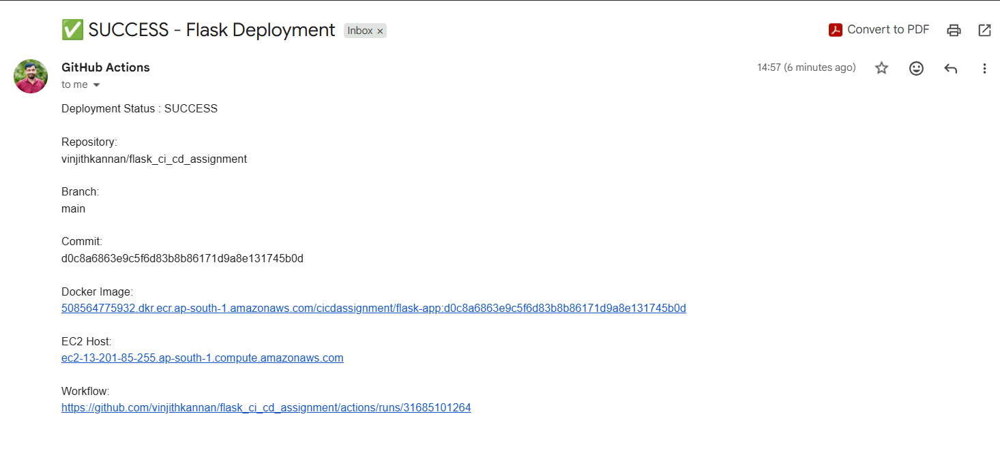

---

# 12. Failed Pipeline Test

To verify that the pipeline correctly handles failures, an intentionally broken test was introduced.

For example, the expected HTTP status code was temporarily changed from:

```python
assert response.status_code == 200
```

to:

```python
assert response.status_code == 404
```

The test therefore failed.

The pipeline stopped at the testing stage and did not continue to Docker build, ECR push, or EC2 deployment.

### Expected Failure Flow

```text
Checkout                 ✅
Install Dependencies     ✅
Pytest                   ❌ FAILED
                         ↓
Docker Build             NOT EXECUTED
ECR Push                 NOT EXECUTED
EC2 Deployment           NOT EXECUTED
```

### Screenshot – Failed Pipeline

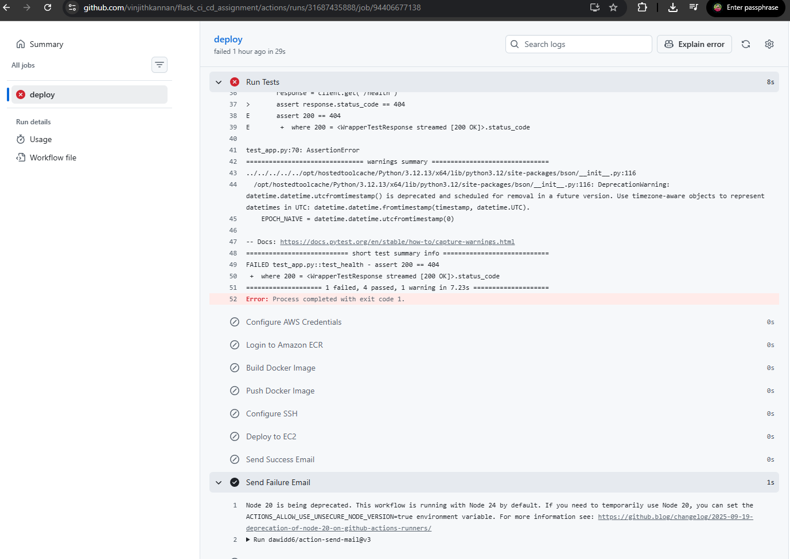

---

# 13. Failure Email

When the intentionally broken test caused the pipeline to fail, a failure email was generated.

The email contains:

* Failure indicator
* Failed stage
* Git commit SHA
* Branch
* GitHub Actions workflow/log URL

Example subject:

```text
FAILED - Flask Deployment
```

The workflow URL allows the failure to be investigated immediately.

### Screenshot – Failure Email

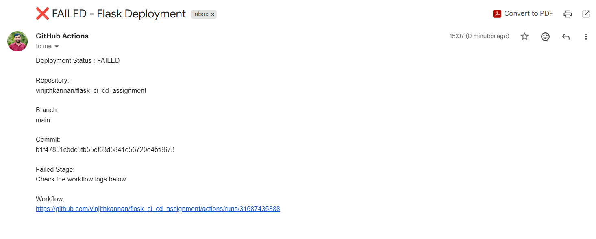

---

# 14. Complete Evidence Summary

The following screenshots are included as evidence of the completed assignment:

| #  | Evidence                | Screenshot                       |
| -- | ----------------------- | -------------------------------- |
| 1  | GitHub Repository       | `01-github-repository.png`       |
| 2  | GitHub Actions Workflow | `02-github-actions-workflow.png` |
| 3  | Green Pipeline          | `03-green-pipeline.png`          |
| 4  | Amazon ECR Image        | `04-ecr-image.png`               |
| 5  | EC2 Running Container   | `05-ec2-running-container.png`   |
| 6  | `docker ps`             | `06-docker-ps.png`               |
| 7  | Browser – Application   | `07-browser-home.png`            |
| 8  | Browser – `/health`     | `08-browser-health.png`          |
| 9  | Success Email           | `09-success-email.png`           |
| 10 | Failed Pipeline         | `10-failed-pipeline.png`         |
| 11 | Failure Email           | `11-failure-email.png`           |

---

# 15. Assignment Requirement Mapping

| Assignment Requirement    | Implementation    | Evidence                  |
| ------------------------- | ----------------- | ------------------------- |
| Flask application         | `app.py`          | GitHub Repository         |
| Health endpoint           | `/health`         | Browser Health Screenshot |
| `requirements.txt`        | Included          | GitHub Repository         |
| Pytest test suite         | `test_app.py`     | Green/Failed Pipeline     |
| Dockerfile                | Included          | GitHub Repository         |
| ECR repository            | Amazon ECR        | ECR Screenshot            |
| EC2 deployment            | Docker on EC2     | EC2 Screenshot            |
| Automated testing         | GitHub Actions    | Green Pipeline            |
| Docker build              | GitHub Actions    | Green Pipeline            |
| SHA-based image tag       | Git commit SHA    | ECR Screenshot            |
| Push to ECR               | GitHub Actions    | ECR Screenshot            |
| Deploy to EC2             | SSH deployment    | EC2 Screenshot            |
| Container verification    | `docker ps`       | Docker PS Screenshot      |
| Application verification  | `/health`         | Browser Screenshot        |
| Success notification      | Email             | Success Email             |
| Failure notification      | Email             | Failure Email             |
| Failure-stage information | Failed test stage | Failure Email             |
| Automatic trigger         | Push to `main`    | GitHub Actions            |
| Secrets management        | GitHub Secrets    | Workflow Configuration    |
| Documentation             | README.md         | Repository                |

---

# 16. Repository and Pipeline Links

### GitHub Repository

https://github.com/vinjithkannan/flask_ci_cd_assignment

### GitHub Actions

https://github.com/vinjithkannan/flask_ci_cd_assignment/actions

### ECR Repository

508564775932.dkr.ecr.ap-south-1.amazonaws.com/cicdassignment/flask-app

---

# 17. Conclusion

This project demonstrates an end-to-end CI/CD pipeline for a Python Flask application.

The implementation integrates:

```text
GitHub
   ↓
GitHub Actions
   ↓
Pytest
   ↓
Docker
   ↓
Amazon ECR
   ↓
Amazon EC2
   ↓
Health Verification
   ↓
Email Notification
```

The successful execution demonstrates automated testing, containerization, image management, cloud deployment, deployment verification, and operational notification.

The intentionally failed execution demonstrates that the pipeline prevents failed code from being deployed and provides an appropriate failure notification for troubleshooting.

